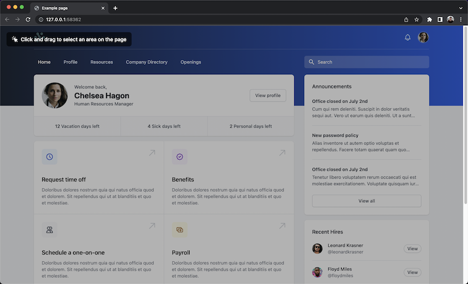
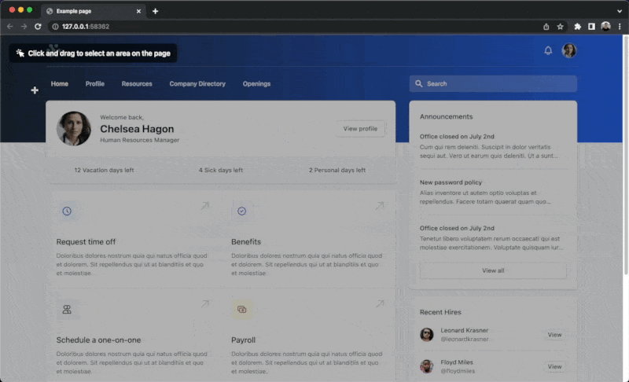
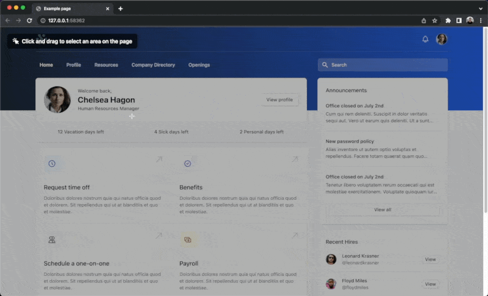

# QA Automation Engineer Test

Below is the tech test we ask engineering applicants to attempt. This repo has been updated to include a not very good solution. To view the solution you can open the index.html file in your browser. Your challenge is to:

1. Setup 2-5 automated tests in your preferred testing framework. Tell us how to install and run them.

2. Report some "bugs" or limitations with this completed solution attempt

Once you are completed please add the repository to a ZIP file and send it to us via email/dropbox/google drive.

# Original Technical Test

To get started with the technical test clone this repo and modify the code as per the instructions below.

In this repository there is a [example web page](index.html), your task is to modify the [script file](script.js) and make this example web page interactive in several ways:

1. Show an overlay that covers the page, and ask the user to click and drag _(note: the screenshots are for rough guidance and don't need to be copied exactly)_

2. Allow the user to draw a box on the page that removes part of this overlay

3. Determine the largest element that is contained within the area that the user has drawn and add a red outline to that element _(hint: `document.elementsFromPoint` and `IntersectionObserver` are two APIs you can use to help determine what elements are in given area)_

